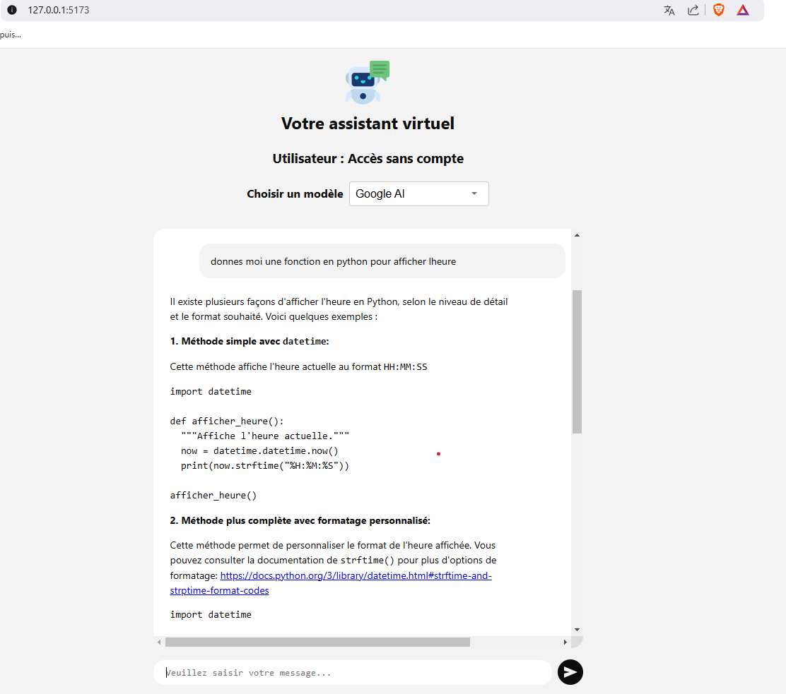

# AI Chatbot Application - React + Google AI (Gemini) Integration

## Description
Une application de chatbot construite avec React.js, intégrant les API de Google AI (Chat GPT) et Open AI (Gemini). Cette application permet de discuter avec un chatbot en temps réel, avec une interface fluide, un mode sombre/clair, et un support Markdown.

## Fonctionnalités
- ** Ollama  et Google AI ** : Intégration des API  pour des réponses générées par l'IA.
- **Streaming en temps réel** : Affichage immédiat des messages.
- **Mode clair et sombre** : Basculement entre les deux modes d'affichage.
- **Champ de texte auto-ajustable** : Pour une meilleure expérience de saisie.
- **État de chargement** : Indicateur visible lors du traitement par l'IA.
- **Support Markdown** : Pour un formatage enrichi des messages.
- **Défilement automatique** : Le chat se déroule pour afficher le dernier message.
- **Authentification Firebase** : Avec le chat on est anonymement authentifié.

## Prérequis
- **Node.js** installé.
- **Clés API** Google AI et Open AI pour l'intégration des services d'IA.
- **Installer un llm en local** Llama2-uncensored utilisé dans ce cas.

## Installation

1. Clonez le projet :
   ```bash
   git clone https://github.com/mbayeScientist/react_Assistant_virtuel_GenAi.git
   cd <nom_du_dossier>

2. Installer les dependances :
   ```bash
   npm install

3. Installer les dependances :
   ```bash
   npm install
4. Installer Ollama avec Docker via le lien : https://hub.docker.com/r/ollama/ollama et  telecharger un modele
   ```bash
   ollama run llama2-uncensored
Ouvrir un navigateur pour verifier si ça fonctionne : http://localhost:11434/

5. Run l'application :
   ```bash
   npm run dev

